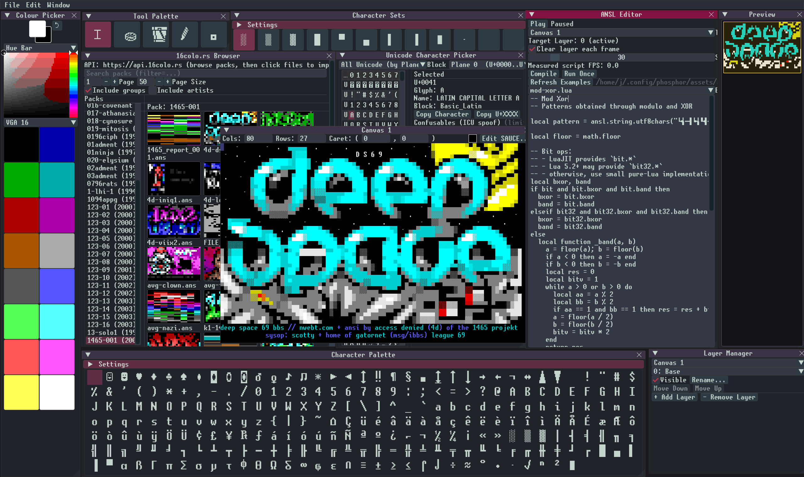

# Phosphor

Phospher is a modern Text Mode Art editor for modern (and old) terminals. It is built around UTF-8, Unscii 2.1 8x16 & Xterm 256(240) colours, and also supports classic DOS/Amiga/etc bitmap fonts and palettes, as well as eXtended Binary with embedded fonts. 

It focuses on practical workflows for ANSI art: layers, palettes, scripting, SAUCE metadata, import/export, and a full featured 16colo.rs browser.

I'm writing this editor for myself, but other's may find it interesting. I welcome positive feedback, constructive criticism, feature requests & bug reports.



## Features

- Native UTF‑8 canvas: store and edit Unicode codepoints directly.
- Multiple fonts + rendering:
  - Per-canvas font selection (persisted via SAUCE `TInfoS` / FontName and used on export).
  - Unicode atlas rendering (Unscii for UI; canvases can render via an atlas font too).
  - Indexed/bitmap rendering for classic textmode fonts (CP437-ordered glyph tables), including support for embedded bitmap fonts (e.g. XBin embedded font chunks) and built-in fonts (IBM VGA codepages, Amiga Topaz/MicroKnight, Terminus, Spleen).
- Layers: add/remove, reorder, rename, and toggle visibility.
- Undo/redo: project-aware undo history persisted inside `.phos`.
- Colour tools: Discrete colour picker + standard palette browser/management.
- Character tools:
  - Unicode Character Picker (ICU-backed) with search and metadata.
  - Character Palettes + Character Sets.
- Scriptable workflows:
  - ANSL editor (LuaJIT): write generative "shaders" that render into the active layer.
  - Tool palette (LuaJIT): all tools are Lua scripts with parameter UI (e.g. pencil/eraser/fill/select).
- Image support:
  - Open common images (`.png/.jpg/.gif/.bmp`) and preview them.
  - Convert images to ANSI-like character art via Chafa (“Convert to ANSI…” creates a new canvas).
- Import/export:
  - ANSI, plaintext, XBin, and raster image export (with presets + detailed options via a tabbed Export dialog).
  - Import `.phos` projects, common ANSI/text files, XBin, and images.
- 16colo.rs browser (API-backed):
  - Browse Packs / Groups / Artists / Years / Latest releases.
  - Thumbnail gallery + filtering, with one-click open for remote ANSI/text and images.
  - HTTP responses are cached on disk for speed/offline-ish reuse.
- Skins:
  - Built-in UI themes (Cherry, Grape, Charcoal) + UI scale.
- SAUCE metadata:
  - Parse SAUCE when importing ANSI/text where present.
  - Edit SAUCE fields in-app and persist them in `.phos` project files.

## File formats

- Project: `.phos`
  - Stored as CBOR, compressed with zstd.
  - Includes layers, colours, caret state, undo/redo history, and SAUCE metadata snapshot.
- Import:
  - ANSI-ish textmode: `.ans`, `.nfo`, `.diz`.
  - Plaintext: `.txt`, `.asc`.
  - XBin: `.xb`.
  - Images: `.png`, `.jpg`, `.jpeg`, `.gif`, `.bmp`.
- Export:
  - ANSI: `.ans` (presets + options for encoding, newlines, colour modes including ANSI16/xterm‑256/truecolour SGR, optional SAUCE).
  - Plaintext: `.txt`, `.asc` (no ANSI escapes; encoding/newline options).
  - XBin: `.xb` (optional palette chunk, RLE compression, NonBlink/iCE flag; optional SAUCE).
  - Images: `.png`, `.jpg` (rendered from the canvas; supports truecolour and indexed palette modes).

## UI windows

From the menu you can toggle:

- Discrete Colour Picker (up to 256 colours)
- Unicode Character Picker
- Character Palette
- Character Sets
- Layer Manager
- ANSL Editor
- Tool Palette
- Minimap (pan/zoom interaction)
- 16colo.rs Browser
- Settings (skin/theme + UI scale + key bindings editor)

From the **File** menu:

- Export… (tabbed Export dialog: ANSI / Plaintext / Image / XBin)

## Configuration + data directories (Linux)

Phosphor uses `XDG_CONFIG_HOME` when available; otherwise defaults to `~/.config/phosphor`.

- `session.json`: UI/window state, open canvases/images, active tool, theme, etc.
- `assets/`: extracted bundled assets on first run (fonts, palettes, key bindings, tools, ANSL examples).
- `cache/`: cache files (including HTTP cache for the 16colo.rs browser).

## Quick start

If you don't have Nix installed yet, see the official installer: `https://nixos.org/download/`.

Run Phosphor directly from the flake:

```bash
nix run github:0xc1c4da/phosphor#phosphor
```

If you have the repo cloned locally:

```bash
nix run .#phosphor
```

## Building from source

This repo builds a native binary called `phosphor`.

### With Nix

```bash
nix develop
make
./phosphor
```

You can also use:

```bash
nix build
nix run
```

### Without Nix

- Install dependencies for: SDL3, Vulkan, Dear ImGui, Chafa, ICU, LuaJIT, zstd, libcurl, nlohmann_json, lodepng, and stb headers.
- Set `IMGUI_DIR` to a checkout of `ocornut/imgui` (or checkout in `vendor/imgui`).
- Set `LDEPNG_DIR` to your LodePNG include directory (the build uses `-I$(LDEPNG_DIR)`).

```bash
make IMGUI_DIR=/path/to/imgui LDEPNG_DIR=/path/to/lodepng
```

## License

MIT License. See [LICENSE](LICENSE).

## Links

- Unscii font: [http://viznut.fi/unscii/](http://viznut.fi/unscii/)
- ANSI art resources: [https://16colo.rs/](https://16colo.rs/)
- Ansilove (formats + fonts): [https://www.ansilove.org/](https://www.ansilove.org/)
- [xeR0](https://x-e.ro/)'s hand-collected tutorials: [https://github.com/xero/ansi-art-tutorials](https://github.com/xero/ansi-art-tutorials)
- [Roy\<SAC\>](https://www.roysac.com/roy.html)'s TheDraw Fonts collection: [https://www.roysac.com/thedrawfonts-tdf.html](https://www.roysac.com/thedrawfonts-tdf.html)

Inspiration & related tools:

- Moebius: [https://blocktronics.github.io/moebius/](https://blocktronics.github.io/moebius/)
- PabloDraw: [https://github.com/cwensley/pablodraw/](https://github.com/cwensley/pablodraw/)
- Icy Draw: [https://github.com/mkrueger/icy_tools/tree/master/crates/icy_draw](https://github.com/mkrueger/icy_tools/tree/master/crates/icy_draw)
- DurDraw: [https://github.com/cmang/durdraw](https://github.com/cmang/durdraw)